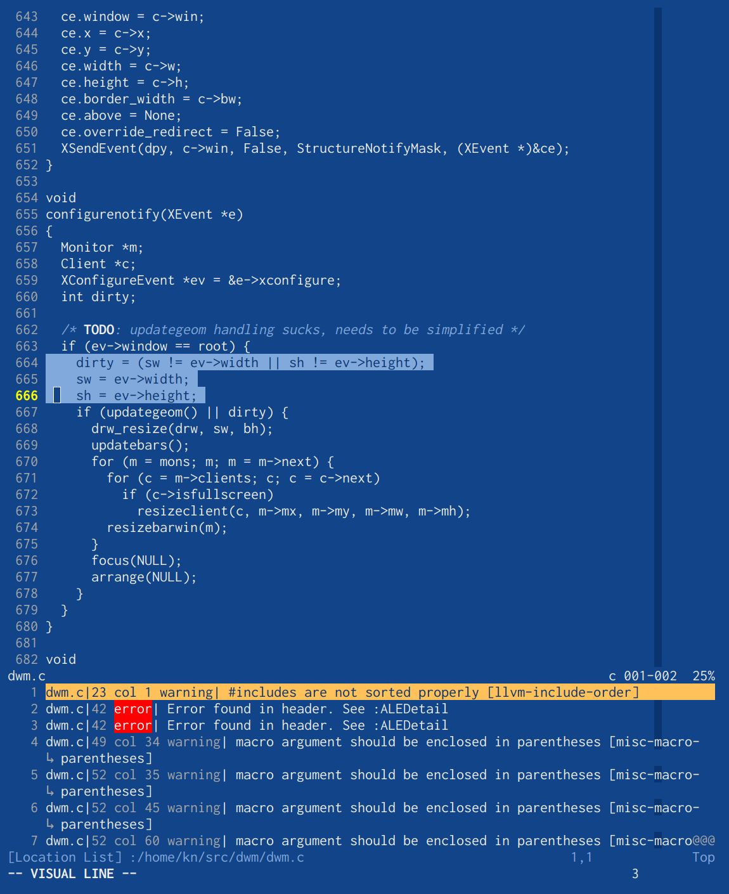

# About
frign is a 24-bit vim color scheme inspired by [frign's screenshot over at
suckless.org][1] and the [nofrils color scheme][2].

* It is designed around the base color `#114488`
* It is ment to be a minimalist, almost monochromatic color scheme. There is
  very little syntax highligting.
* It is designed to keep itself out of your way.
* It does support 8-bit colors but it looks terrible and is not recommended.
* If you don't like blue, this color scheme is not for you :)

# Screenshots

C with the location list open:

Go:

Python with tagbar and Pmenu open:

[1]: https://st.suckless.org/screenshots/frign-2016.png
[2]: https://github.com/robertmeta/nofrils
